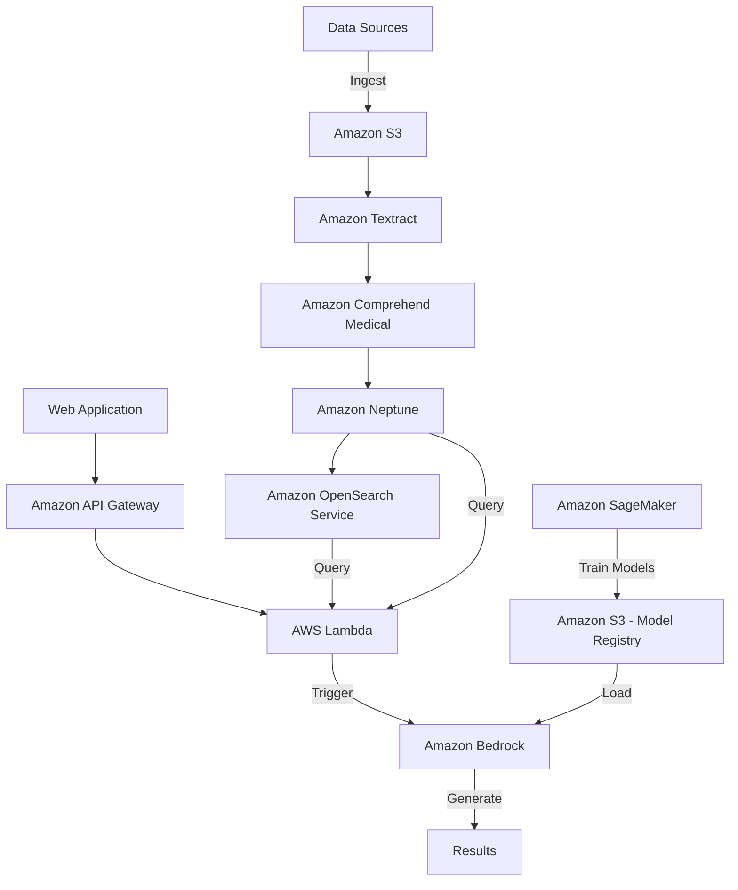

# RAG-based AWS Solution for Pharmaceutical Drug Discovery

This project implements a Retrieval-Augmented Generation (RAG) based solution for pharmaceutical drug discovery using AWS services, including Amazon Bedrock. The system processes scientific literature, builds a knowledge graph, and leverages large language models to assist in drug discovery tasks.

## Table of Contents

- [Architecture Overview](#architecture-overview)
- [Project Structure](#project-structure)
- [Prerequisites](#prerequisites)
- [Setup Instructions](#setup-instructions)
- [Usage](#usage)
- [Contributing](#contributing)
- [License](#license)

## Architecture Overview



Our solution utilizes the following AWS services:

- Amazon S3 for data storage
- Amazon Textract for document processing
- Amazon Comprehend Medical for medical entity extraction
- Amazon Neptune for knowledge graph storage
- Amazon OpenSearch Service for creating searchable indexes
- Amazon SageMaker for custom ML model training
- AWS Lambda for orchestration
- Amazon Bedrock for leveraging large language models
- Amazon API Gateway for exposing APIs

## Project Structure

```
rag-drug-discovery/
├── data/
│   ├── raw/
│   └── processed/
├── src/
│   ├── data_processing/
│   │   ├── textract_processor.py
│   │   └── comprehend_medical_processor.py
│   ├── knowledge_graph/
│   │   └── neptune_manager.py
│   ├── search/
│   │   └── opensearch_manager.py
│   ├── ml/
│   │   └── sagemaker_training.py
│   ├── rag/
│   │   ├── bedrock_interface.py
│   │   └── lambda_function.py
│   └── api/
│       └── api_gateway_setup.py
├── web_app/
│   ├── frontend/
│   └── backend/
├── tests/
├── docs/
├── config/
├── requirements.txt
├── setup.py
└── README.md
```

## Prerequisites

- AWS Account with appropriate permissions
- Python 3.8+
- AWS CLI configured
- Node.js and npm (for web application)

## Setup Instructions

1. Clone the repository:
   ```
   git clone https://github.com/your-username/rag-drug-discovery.git
   cd rag-drug-discovery
   ```

2. Set up a virtual environment:
   ```
   python -m venv venv
   source venv/bin/activate  # On Windows, use `venv\Scripts\activate`
   ```

3. Install dependencies:
   ```
   pip install -r requirements.txt
   ```

4. Configure AWS services:
   - Set up S3 buckets for raw and processed data
   - Configure Amazon Textract and Comprehend Medical
   - Set up Amazon Neptune instance
   - Create an OpenSearch domain
   - Configure SageMaker for model training
   - Set up Lambda functions
   - Configure Amazon Bedrock
   - Set up API Gateway

5. Update the `config/` directory with your AWS resource configurations.

6. Deploy the web application (instructions in `web_app/README.md`).

## Usage

1. Upload raw data to the S3 input bucket.
2. Run data processing scripts to extract and process information.
3. Build the knowledge graph and search index.
4. Train custom ML models if required.
5. Use the web application to interact with the system, perform queries, and generate insights for drug discovery.

## Contributing

We welcome contributions to improve this drug discovery solution. Please follow these steps:

1. Fork the repository
2. Create a new branch (`git checkout -b feature/your-feature`)
3. Make your changes
4. Commit your changes (`git commit -am 'Add some feature'`)
5. Push to the branch (`git push origin feature/your-feature`)
6. Create a new Pull Request

## License

This project is licensed under the MIT License - see the [LICENSE](LICENSE) file for details.
